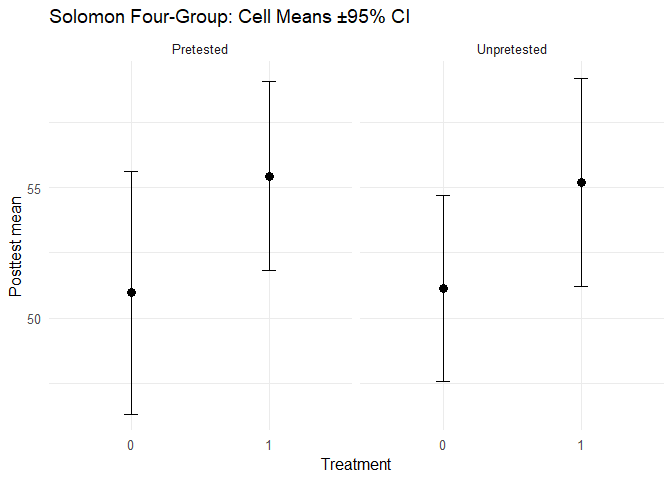

<!-- README.md is generated from README.Rmd. Please edit that file -->

# solomonR

<!-- badges: start -->

[](https://github.com/JUhalt/solomonR/actions/workflows/R-CMD-check.yaml)
[](https://juhalt.github.io/solomonR/)
[](https://lifecycle.r-lib.org/articles/stages.html)
<!-- badges: end -->

The goal of solomonR is to …

# solomonR

Tools to analyze **Solomon Four-Group Designs** (SFGD) with both the
classic teaching workflow and a modern unified GLM: - Classic flow: 2×2
posttest ANOVA → (if no sensitization) ANCOVA on pretested cells +
posttest-only t, optional Stouffer combine (Braver & Braver, 1988).  
- Modern flow: one GLM with robust SEs + key contrasts, permutation
p-values, effect sizes, and diagnostic helpers.

## Installation

``` r
# install.packages("pak")
pak::pak("JUhalt/solomonR")
#> ℹ Loading metadata database✔ Loading metadata database ... done
#>  
#> ℹ No downloads are needed
#> ✔ 1 pkg + 46 deps: kept 46 [5.1s]
```

## Quick Start

``` r
library(solomonR)

set.seed(1)
n <- 20
pretested <- c(rep(1, 2*n), rep(0, 2*n))
treat     <- c(rep(1,n), rep(0,n), rep(1,n), rep(0,n))
y_pre     <- c(rnorm(n, 50,10), rnorm(n, 50,10), rep(NA, 2*n))

# Data-generating process: treatment bumps posttest by 0.4 SD
eps <- rnorm(4*n, 0, 10)
y_post <- 50 + 0.5*ifelse(pretested==1 & !is.na(y_pre), scale(y_pre), 0) + 4*treat + eps

# Modern unified GLM
fit_g <- fit_solomon_glm(y = y_post, treat = treat, pretested = pretested, pretest_score = y_pre)
print(fit_g)            # t.test/ANOVA-like summary with key contrasts
#> Solomon GLM (unified model)
#> Formula: y ~ treat * pretested + pre_obs
#> <environment: 0x000001610035d318>
#> 
#> Coefficients (robust SEs):
#>             term estimate std.error statistic   p.value
#>      (Intercept)   51.138     2.000    25.563 3.89e-144
#>            treat    4.060     2.829     1.435  1.51e-01
#>        pretested  -14.991     8.598    -1.744  8.12e-02
#>          pre_obs    0.297     0.163     1.825  6.81e-02
#>  treat:pretested   -0.163     4.014    -0.041  9.68e-01
#> 
#> Key contrasts:
#>                 contrast estimate std.error statistic  p.value
#>   ATE (avg over pretest)     4.06     2.829     1.435 1.51e-01
#>      Pretest x Treatment     4.06     2.829     1.435 1.51e-01
#>      Pretest x Treatment     3.06     2.829     1.082 2.79e-01
#>      Pretest x Treatment     2.06     2.829     0.728 4.66e-01
#>      Pretest x Treatment     1.06     2.829     0.375 7.08e-01
#>      Pretest x Treatment     0.06     2.829     0.021 9.83e-01
#>      Pretest x Treatment    -0.94     2.829    -0.332 7.40e-01
#>      Pretest x Treatment    -1.94     2.829    -0.686 4.93e-01
#>      Pretest x Treatment    -2.94     2.829    -1.039 2.99e-01
#>      Pretest x Treatment    -3.94     2.829    -1.393 1.64e-01
#>      Pretest x Treatment    -4.94     2.829    -1.746 8.08e-02
#>      Pretest x Treatment    -5.94     2.829    -2.100 3.58e-02
#>      Pretest x Treatment    -6.94     2.829    -2.453 1.42e-02
#>      Pretest x Treatment    -7.94     2.829    -2.807 5.01e-03
#>      Pretest x Treatment    -8.94     2.829    -3.160 1.58e-03
#>      Pretest x Treatment    -9.94     2.829    -3.513 4.42e-04
#>      Pretest x Treatment   -10.94     2.829    -3.867 1.10e-04
#>      Pretest x Treatment   -11.94     2.829    -4.220 2.44e-05
#>      Pretest x Treatment   -12.94     2.829    -4.574 4.79e-06
#>      Pretest x Treatment   -13.94     2.829    -4.927 8.33e-07
#>      Pretest x Treatment   -14.94     2.829    -5.281 1.29e-07
#>    Treatment | pretested     8.12     5.658     1.435 1.51e-01
#>    Treatment | pretested     7.12     5.658     1.258 2.08e-01
#>    Treatment | pretested     6.12     5.658     1.082 2.79e-01
#>    Treatment | pretested     5.12     5.658     0.905 3.65e-01
#>    Treatment | pretested     4.12     5.658     0.728 4.66e-01
#>    Treatment | pretested     3.12     5.658     0.551 5.81e-01
#>    Treatment | pretested     2.12     5.658     0.375 7.08e-01
#>    Treatment | pretested     1.12     5.658     0.198 8.43e-01
#>    Treatment | pretested     0.12     5.658     0.021 9.83e-01
#>    Treatment | pretested    -0.88     5.658    -0.155 8.76e-01
#>    Treatment | pretested    -1.88     5.658    -0.332 7.40e-01
#>    Treatment | pretested    -2.88     5.658    -0.509 6.11e-01
#>    Treatment | pretested    -3.88     5.658    -0.686 4.93e-01
#>    Treatment | pretested    -4.88     5.658    -0.862 3.88e-01
#>    Treatment | pretested    -5.88     5.658    -1.039 2.99e-01
#>    Treatment | pretested    -6.88     5.658    -1.216 2.24e-01
#>    Treatment | pretested    -7.88     5.658    -1.393 1.64e-01
#>    Treatment | pretested    -8.88     5.658    -1.569 1.17e-01
#>    Treatment | pretested    -9.88     5.658    -1.746 8.08e-02
#>    Treatment | pretested   -10.88     5.658    -1.923 5.45e-02
#>  Treatment | unpretested     4.06     2.829     1.435 1.51e-01
print(summary(fit_g))   # structured summary
#> Summary: Solomon GLM (unified model)
#> Formula: y ~ treat * pretested + pre_obs
#> <environment: 0x000001610035d318>
#> 
#> Coefficients (robust SEs):
#>             term estimate std.error statistic   p.value
#>      (Intercept)   51.138     2.000    25.563 3.89e-144
#>            treat    4.060     2.829     1.435  1.51e-01
#>        pretested  -14.991     8.598    -1.744  8.12e-02
#>          pre_obs    0.297     0.163     1.825  6.81e-02
#>  treat:pretested   -0.163     4.014    -0.041  9.68e-01
#> 
#> Key contrasts:
#>                 contrast estimate std.error statistic  p.value    r2 r2_lo
#>   ATE (avg over pretest)     4.06     2.829     1.435 1.51e-01    NA    NA
#>      Pretest x Treatment     4.06     2.829     1.435 1.51e-01 0.024 0.005
#>      Pretest x Treatment     3.06     2.829     1.082 2.79e-01    NA    NA
#>      Pretest x Treatment     2.06     2.829     0.728 4.66e-01    NA    NA
#>      Pretest x Treatment     1.06     2.829     0.375 7.08e-01    NA    NA
#>      Pretest x Treatment     0.06     2.829     0.021 9.83e-01    NA    NA
#>      Pretest x Treatment    -0.94     2.829    -0.332 7.40e-01    NA    NA
#>      Pretest x Treatment    -1.94     2.829    -0.686 4.93e-01    NA    NA
#>      Pretest x Treatment    -2.94     2.829    -1.039 2.99e-01    NA    NA
#>      Pretest x Treatment    -3.94     2.829    -1.393 1.64e-01    NA    NA
#>      Pretest x Treatment    -4.94     2.829    -1.746 8.08e-02    NA    NA
#>      Pretest x Treatment    -5.94     2.829    -2.100 3.58e-02    NA    NA
#>      Pretest x Treatment    -6.94     2.829    -2.453 1.42e-02    NA    NA
#>      Pretest x Treatment    -7.94     2.829    -2.807 5.01e-03    NA    NA
#>      Pretest x Treatment    -8.94     2.829    -3.160 1.58e-03    NA    NA
#>      Pretest x Treatment    -9.94     2.829    -3.513 4.42e-04    NA    NA
#>      Pretest x Treatment   -10.94     2.829    -3.867 1.10e-04    NA    NA
#>      Pretest x Treatment   -11.94     2.829    -4.220 2.44e-05    NA    NA
#>      Pretest x Treatment   -12.94     2.829    -4.574 4.79e-06    NA    NA
#>      Pretest x Treatment   -13.94     2.829    -4.927 8.33e-07    NA    NA
#>      Pretest x Treatment   -14.94     2.829    -5.281 1.29e-07    NA    NA
#>    Treatment | pretested     8.12     5.658     1.435 1.51e-01    NA    NA
#>    Treatment | pretested     7.12     5.658     1.258 2.08e-01    NA    NA
#>    Treatment | pretested     6.12     5.658     1.082 2.79e-01    NA    NA
#>    Treatment | pretested     5.12     5.658     0.905 3.65e-01    NA    NA
#>    Treatment | pretested     4.12     5.658     0.728 4.66e-01    NA    NA
#>    Treatment | pretested     3.12     5.658     0.551 5.81e-01    NA    NA
#>    Treatment | pretested     2.12     5.658     0.375 7.08e-01    NA    NA
#>    Treatment | pretested     1.12     5.658     0.198 8.43e-01    NA    NA
#>    Treatment | pretested     0.12     5.658     0.021 9.83e-01    NA    NA
#>    Treatment | pretested    -0.88     5.658    -0.155 8.76e-01    NA    NA
#>    Treatment | pretested    -1.88     5.658    -0.332 7.40e-01    NA    NA
#>    Treatment | pretested    -2.88     5.658    -0.509 6.11e-01    NA    NA
#>    Treatment | pretested    -3.88     5.658    -0.686 4.93e-01    NA    NA
#>    Treatment | pretested    -4.88     5.658    -0.862 3.88e-01    NA    NA
#>    Treatment | pretested    -5.88     5.658    -1.039 2.99e-01    NA    NA
#>    Treatment | pretested    -6.88     5.658    -1.216 2.24e-01    NA    NA
#>    Treatment | pretested    -7.88     5.658    -1.393 1.64e-01    NA    NA
#>    Treatment | pretested    -8.88     5.658    -1.569 1.17e-01    NA    NA
#>    Treatment | pretested    -9.88     5.658    -1.746 8.08e-02    NA    NA
#>    Treatment | pretested   -10.88     5.658    -1.923 5.45e-02    NA    NA
#>  Treatment | unpretested     4.06     2.829     1.435 1.51e-01    NA    NA
#>  r2_hi
#>     NA
#>  0.129
#>     NA
#>     NA
#>     NA
#>     NA
#>     NA
#>     NA
#>     NA
#>     NA
#>     NA
#>     NA
#>     NA
#>     NA
#>     NA
#>     NA
#>     NA
#>     NA
#>     NA
#>     NA
#>     NA
#>     NA
#>     NA
#>     NA
#>     NA
#>     NA
#>     NA
#>     NA
#>     NA
#>     NA
#>     NA
#>     NA
#>     NA
#>     NA
#>     NA
#>     NA
#>     NA
#>     NA
#>     NA
#>     NA
#>     NA
#>     NA
plot_solomon_gg(y_post, treat, pretested)  # quick visual
```



``` r

# Classic teaching flow
fit_c <- fit_solomon_classic(y_post, treat, pretested, y_pre)
print(fit_c)            # ANOVA → ANCOVA / Welch t → optional Stouffer Z
#> Classic Solomon analysis
#> 
#> 2x2 ANOVA on posttest (tests sensitization via interaction):
#> # A tibble: 4 × 6
#>   term               df     sumsq   meansq statistic p.value
#>   <chr>           <dbl>     <dbl>    <dbl>     <dbl>   <dbl>
#> 1 treat               1  365.     365.      4.42      0.0388
#> 2 pretested           1    0.0235   0.0235  0.000285  0.987 
#> 3 treat:pretested     1    0.888    0.888   0.0108    0.918 
#> 4 Residuals          76 6269.      82.5    NA        NA     
#> 
#> ANCOVA on pretested cells (Groups 1 & 2):
#> # A tibble: 3 × 5
#>   term           estimate std.error statistic  p.value
#>   <chr>             <dbl>     <dbl>     <dbl>    <dbl>
#> 1 (Intercept)      36.1       8.65       4.18 0.000171
#> 2 treat[idx_pre]    3.90      2.94       1.32 0.194   
#> 3 y_pre[idx_pre]    0.297     0.168      1.76 0.0859  
#> 
#> Posttest-only Welch t (Groups 3 & 4):
#> # A tibble: 1 × 10
#>   estimate estimate1 estimate2 statistic p.value parameter conf.low conf.high
#>      <dbl>     <dbl>     <dbl>     <dbl>   <dbl>     <dbl>    <dbl>     <dbl>
#> 1    -4.06      51.1      55.2     -1.49   0.146      37.5    -9.59      1.47
#> # ℹ 2 more variables: method <chr>, alternative <chr>

# Assumptions & diagnostics
check_solomon_assumptions(y_post, treat, pretested, y_pre)
#> $brown_forsythe_4cell_p
#> [1] 0.8581486
#> 
#> $brown_forsythe_unpre_p
#> [1] 0.4677638
#> 
#> $shapiro_p_by_cell
#>        0.0        1.0        0.1        1.1 
#> 0.03058808 0.44929286 0.45692114 0.87119333 
#> 
#> $ancova_slope_homogeneity_p
#> [1] 0.8853772
#> 
#> $notes
#> [1] "Use Welch t for Groups 3 vs 4 if brown_forsythe_unpre_p < .05 (you already do)."                                                            
#> [2] "Prefer HC3 SEs (your default) if brown_forsythe_4cell_p < .05."                                                                             
#> [3] "If ancova_slope_homogeneity_p < .05, ANCOVA assumption is violated; prefer the unified GLM with interaction terms or a permutation p-value."
```

## What you get

- **Key contrasts** (ATE, pretest×treat, simple effects) with **robust
  SEs** and **semi-partial R² (±CI)**
- **Hedges’ g (±CI)** for Groups 3 vs 4 (posttest-only)
- **Permutation tests** for contrasts, **diagnostics** (Brown–Forsythe,
  Shapiro by cell, ANCOVA slope homogeneity)
- **Base plot + ggplot** cell-means CIs

See the vignettes:

- Classic Solomon Analysis (Teaching Flow)
- Unified GLM for Solomon Four-Group Designs
