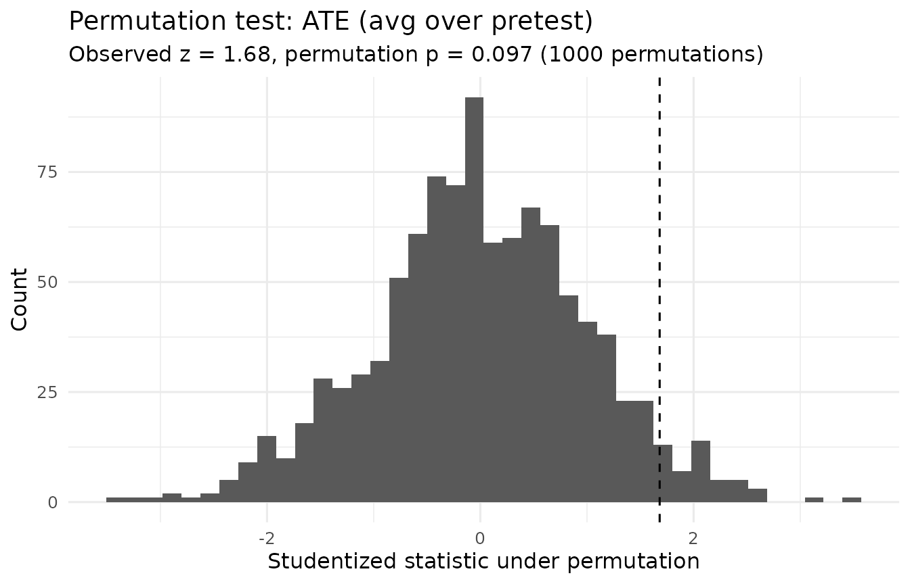

# Modern Analysis of the Solomon Four-Group Design

## A unified approach

The Solomon four-group design is often introduced through a sequence of
separate analyses.

A modern alternative is to represent the four-group design in a single
model and estimate the scientifically relevant questions as explicit
contrasts.

For a continuous posttest outcome, the core model in `solomonR` is

``` math
Y =
\beta_0 +
\beta_T T +
\beta_P P +
\beta_{TP}(T \times P) +
\beta_X X_{\mathrm{obs}} +
\varepsilon,
```

where:

- $`T`$ indicates treatment assignment;
- $`P`$ indicates whether a participant was pretested;
- $`T \times P`$ represents pretest sensitization; and
- $`X_{\mathrm{obs}}`$ incorporates the pretest information available in
  the pretested groups.

`solomonR` then estimates four predefined Solomon contrasts from this
model.

## Structural missingness of the pretest

One unusual feature of the Solomon design deserves special attention.

Participants in Groups 3 and 4 were deliberately **not pretested**.
Their absent pretest values are therefore structurally missing by
design.

Simply placing the raw pretest variable into an ordinary regression
formula can cause complete-case deletion of Groups 3 and 4, destroying
the four-group design.

[`fit_solomon_glm()`](https://juhalt.github.io/solomonR/reference/fit_solomon_glm.md)
avoids this problem internally. For the optional pretest covariate, the
model uses the observed pretest score among pretested participants and a
design-safe value among participants for whom the pretest was never
administered.

The pretest indicator remains in the model, so this coding does not
pretend that Groups 3 and 4 actually had baseline scores of zero.

## Example data

``` r

library(solomonR)

data(solomon_example)

demo_preview <- head(
  solomon_example,
  6
)

demo_preview$y_post <- round(
  demo_preview$y_post,
  2
)

demo_preview$y_pre <- round(
  demo_preview$y_pre,
  2
)

knitr::kable(
  demo_preview,
  align = "rrrr"
)
```

| y_post | treat | pretested | y_pre |
|-------:|------:|----------:|------:|
|     60 |     1 |         1 |    55 |
|     71 |     1 |         1 |    42 |
|     58 |     1 |         1 |    58 |
|     54 |     1 |         1 |    34 |
|     57 |     1 |         1 |    42 |
|     45 |     1 |         1 |    38 |

## Fit the model

The unified model with HC3 heteroskedasticity-consistent covariance, the
default, is a sound starting point for continuous outcomes.

``` r

fit <- with(
  solomon_example,
  fit_solomon_glm(
    y = y_post,
    treat = treat,
    pretested = pretested,
    pretest_score = y_pre,
    robust = "HC3"
  )
)

fit
```

    ## Solomon GLM (unified model)
    ## Formula: y ~ treat * pretested + pre_obs
    ## Covariance: HC3 heteroskedasticity-consistent; t tests (df = 115)
    ## 
    ## Term             Est (SE)             t   df      p              95% CI
    ## (Intercept)      51.100 (1.739)   29.39  115  <.001    [47.656, 54.544]
    ## treat            3.633 (2.229)     1.63  115  0.106     [-0.782, 8.049]
    ## pretested        -26.219 (5.957)  -4.40  115  <.001  [-38.019, -14.418]
    ## pre_obs          0.598 (0.101)     5.91  115  <.001      [0.397, 0.798]
    ## treat:pretested  -1.940 (3.168)   -0.61  115  0.541     [-8.214, 4.335]
    ## 
    ## Key contrasts            Est (SE)            t   df      p           95% CI  Wald R2
    ## ATE (avg over pretest)   2.663 (1.584)    1.68  115  0.095  [-0.474, 5.801]    0.024
    ## Pretest x Treatment      -1.940 (3.168)  -0.61  115  0.541  [-8.214, 4.335]    0.003
    ## Treatment | pretested    1.693 (2.251)    0.75  115  0.453  [-2.765, 6.152]    0.005
    ## Treatment | unpretested  3.633 (2.229)    1.63  115  0.106  [-0.782, 8.049]    0.023
    ## 
    ## Wald R2: partial R-squared for conventional Gaussian OLS;
    ## a Wald-based descriptive approximation when robust covariance is used.

The output contains model coefficients followed by the four principal
Solomon contrasts.

The contrasts can also be accessed directly:

``` r

effects_display <- fit$effects[
  ,
  c(
    "contrast",
    "estimate",
    "std.error",
    "statistic",
    "p.value",
    "r2"
  )
]

effects_display$estimate <- sprintf(
  "%.2f",
  effects_display$estimate
)

effects_display$std.error <- sprintf(
  "%.2f",
  effects_display$std.error
)

effects_display$statistic <- sprintf(
  "%.2f",
  effects_display$statistic
)

effects_display$p.value <- ifelse(
  effects_display$p.value < .001,
  "< .001",
  sub(
    "^0",
    "",
    sprintf(
      "%.3f",
      effects_display$p.value
    )
  )
)

effects_display$r2 <- sub(
  "^0",
  "",
  sprintf(
    "%.3f",
    effects_display$r2
  )
)

names(effects_display) <- c(
  "Contrast",
  "Estimate",
  "SE",
  "t",
  "p",
  "Wald R2"
)

knitr::kable(
  effects_display,
  align = c(
    "l",
    "r",
    "r",
    "r",
    "r",
    "r"
  )
)
```

| Contrast                 | Estimate |   SE |     t |    p | Wald R2 |
|:-------------------------|---------:|-----:|------:|-----:|--------:|
| ATE (avg over pretest)   |     2.66 | 1.58 |  1.68 | .095 |    .024 |
| Pretest x Treatment      |    -1.94 | 3.17 | -0.61 | .541 |    .003 |
| Treatment \| pretested   |     1.69 | 2.25 |  0.75 | .453 |    .005 |
| Treatment \| unpretested |     3.63 | 2.23 |  1.63 | .106 |    .023 |

## The four Solomon estimands

### Average treatment effect

The reported ATE is the treatment effect averaged equally over the two
pretest conditions:

``` math
ATE =
\beta_T +
\frac{1}{2}\beta_{TP}.
```

This distinction is important.

With the unpretested condition used as the reference group, $`\beta_T`$
by itself is the treatment effect among **unpretested** participants. It
is not the equal-weighted Solomon ATE.

### Pretest x Treatment

The sensitization contrast is

``` math
\beta_{TP}.
```

It asks whether the treatment effect differs according to whether the
pretest was administered.

A statistically nonsignificant interaction should not be interpreted as
proof that sensitization is absent. The equivalence test described below
addresses that stronger question.

### Treatment effect among pretested participants

The treatment effect among participants who received the pretest is

``` math
\beta_T + \beta_{TP}.
```

### Treatment effect among unpretested participants

The treatment effect among participants who did not receive the pretest
is

``` math
\beta_T.
```

Together, these contrasts describe both the treatment effect and its
possible modification by pretesting.

## Why HC3?

The `robust` argument controls covariance estimation.

``` r

fit_solomon_glm(
  y_post,
  treat,
  pretested,
  y_pre,
  robust = "none"
)

fit_solomon_glm(
  y_post,
  treat,
  pretested,
  y_pre,
  robust = "HC3"
)
```

HC3, the default, provides heteroskedasticity-consistent standard errors
(MacKinnon & White, 1985). Long and Ervin (2000) recommend HC3 when the
sample is below about 250, and Hayes and Cai (2007) recommend
heteroskedasticity-consistent standard errors as routine practice. The
Solomon design adds its own reason: adjusting for the pretest reduces
residual variance only in the pretested groups, so the unified model is
heteroskedastic whenever the pretest predicts the posttest.

For Gaussian models, tests and confidence intervals use the t
distribution with residual degrees of freedom, with or without robust
covariance; binomial and Poisson models use the normal distribution. The
`df`, `conf.low`, and `conf.high` columns of `fit$effects` record the
reference distribution and interval for each contrast, and `conf_level`
sets the confidence level.

A CR2 covariance option is also available for clustered data:

``` r

fit_solomon_glm(
  y_post,
  treat,
  pretested,
  y_pre,
  robust = "CR2",
  cluster = cluster_id
)
```

CR2 combines the bias-reduced cluster-robust covariance estimator (Bell
& McCaffrey, 2002) with Satterthwaite degrees of freedom for each
coefficient and contrast (Pustejovsky & Tipton, 2018). The degrees of
freedom are reported in the `df` column and can be small when there are
few clusters.

## Is sensitization negligible?

A nonsignificant Pretest x Treatment contrast does not show that
sensitization is absent. An equivalence test asks a different question:
can effects at least as large as the smallest effect size of interest
(SESOI) be rejected?
[`equivalence_solomon()`](https://juhalt.github.io/solomonR/reference/equivalence_solomon.md)
performs the two one-sided tests (TOST) procedure (Lakens, 2017).

The bounds must be set before the data are examined. Suppose that,
before collecting data, the researchers noted that prior studies with
this measure reported a posttest standard deviation of about 10 points,
and decided that sensitization smaller than half a standard deviation (5
points) would be negligible.

``` r

equivalence_solomon(fit, bounds = 5)
```

    ## Solomon equivalence test (TOST)
    ## Contrast: Pretest x Treatment
    ## Equivalence bounds (raw scale): [-5.000, 5.000]; alpha = 0.05
    ## Inference: HC3 heteroskedasticity-consistent; t tests (df = 115)
    ## 
    ## Estimate = -1.940 (SE = 3.168)
    ## 90% CI [-7.193, 3.313] (equivalence); 95% CI [-8.214, 4.335] (test against zero)
    ## 
    ## Lower bound test:   t(115) = 0.97, p = 0.168
    ## Upper bound test:   t(115) = -2.19, p = 0.015
    ## Equivalence (TOST): p = 0.168
    ## Test against zero:  t(115) = -0.61, p = 0.541
    ## 
    ## Conclusion: Inconclusive: the contrast is neither different from zero nor
    ##   statistically equivalent.
    ## Equivalence bounds must be justified and fixed before the data are examined;
    ## see ?equivalence_solomon.

With 30 participants per group, the 90% confidence interval still
extends beyond the bounds, so the result is inconclusive: these data can
neither detect sensitization nor rule out sensitization of that size.
Equivalence tests need adequate power of their own (Lakens, 2017), so
equivalence bounds belong in study planning.

## Wald-based partial R-squared

For Gaussian models,
[`fit_solomon_glm()`](https://juhalt.github.io/solomonR/reference/fit_solomon_glm.md)
reports a Wald-based partial $`R^2`$ for each one-degree-of-freedom
contrast.

With conventional Gaussian OLS covariance,

``` math
R^2_{\mathrm{partial}} =
\frac{t^2}{t^2 + df_{\mathrm{residual}}}.
```

When a robust covariance estimator such as HC3 is used, `solomonR`
applies the same transformation to the robust Wald statistic. In that
case the result should be interpreted as a **descriptive Wald-based
approximation**, not an exact decomposition of model variance.

For conventional Gaussian fits (`robust = "none"`), `r2_lo` and `r2_hi`
give a confidence interval from the noncentral F distribution (Steiger,
2004). No interval is reported with robust covariance, because that
pivot no longer applies.

``` r

r2_display <- fit$effects[
  ,
  c(
    "contrast",
    "r2"
  )
]

r2_display$r2 <- sub(
  "^0",
  "",
  sprintf(
    "%.3f",
    r2_display$r2
  )
)

names(r2_display) <- c(
  "Contrast",
  "Wald R2"
)

knitr::kable(
  r2_display,
  align = c("l", "r")
)
```

| Contrast                 | Wald R2 |
|:-------------------------|--------:|
| ATE (avg over pretest)   |    .024 |
| Pretest x Treatment      |    .003 |
| Treatment \| pretested   |    .005 |
| Treatment \| unpretested |    .023 |

## Diagnostics

The package provides design-relevant diagnostics through
[`check_solomon_assumptions()`](https://juhalt.github.io/solomonR/reference/check_solomon_assumptions.md).

``` r

checks <- with(
  solomon_example,
  check_solomon_assumptions(
    y_post,
    treat,
    pretested,
    y_pre
  )
)

checks
```

    ## Solomon assumption diagnostics (descriptive)
    ##   Equal variance, four posttest cells (Brown-Forsythe) p = 0.147
    ##   Equal variance, unpretested cells (Brown-Forsythe)   p = 0.297
    ##   Normality within cells (Shapiro-Wilk, smallest p)    p = 0.006
    ##   Homogeneous slopes, pretested groups (Treat x Pre)   p = 0.108
    ## 
    ## These p-values describe the data; they are not gates for choosing an
    ## analysis. Selecting a test because a preliminary assumption test was or
    ## was not significant can distort Type I error rates (Zimmerman, 2004).
    ## HC3 robust standard errors are a reasonable default for the unified GLM
    ## regardless of these results (Long & Ervin, 2000). A small slope p-value
    ## suggests the treatment effect in pretested groups depends on the pretest
    ## score, which is substantively informative.

These include variance checks, cell-level distribution summaries, and
assessment of ANCOVA slope homogeneity.

Diagnostics should inform analysis choices rather than be treated as a
mechanical series of pass/fail gates.

## Randomization-based inference

If treatment assignment was genuinely randomized within the Solomon
pretesting conditions, treatment-label permutation provides another
inferential approach.

``` r

perm <- perm_solomon(
  fit,
  contrast = "ATE (avg over pretest)",
  reps = 1000,
  seed = 42,
  return_dist = TRUE
)

perm
```

    ## Solomon randomization test
    ## --------------------------
    ## Contrast: ATE (avg over pretest)
    ## Observed studentized statistic: z = 1.68
    ## Permutation p = .097
    ## Valid permutations: 1000 of 1000
    ## Permutation distribution retained (1000 draws); use plot_perm() to visualize it.

[`perm_solomon()`](https://juhalt.github.io/solomonR/reference/perm_solomon.md)
shuffles treatment labels **within pretest strata**. This preserves the
number of treated and control participants within the pretested and
unpretested portions of the design.

The test uses an HC3-studentized statistic.

Its Monte Carlo p-value uses a finite-simulation correction:

``` math
p =
\frac{B_{\mathrm{extreme}} + 1}
     {B_{\mathrm{valid}} + 1}.
```

This prevents an estimated permutation p-value of exactly zero.

The null distribution can be visualized with:

``` r

plot_perm(perm)
```



Randomization inference is justified by the assignment mechanism, not
merely by a small sample size. If treatment was randomized at the
cluster level, permutation must likewise occur at the cluster level.
[`perm_solomon()`](https://juhalt.github.io/solomonR/reference/perm_solomon.md)
permutes individuals, so it refuses fits that include a clustering
variable; use the CR2 tests above for clustered designs.

## A likelihood-based alternative

[`fit_solomon_ml()`](https://juhalt.github.io/solomonR/reference/fit_solomon_ml.md)
provides a full-information maximum-likelihood analysis inspired by van
Engelenburg’s treatment of the Solomon four-group design.

``` r

ml <- with(
  solomon_example,
  fit_solomon_ml(
    y_post,
    treat,
    pretested,
    y_pre,
    inference = "satterthwaite"
  )
)

ml
```

    ## Solomon full-information maximum-likelihood model
    ## -------------------------------------------------
    ## Method: van Engelenburg (1999)
    ## Inference: small-sample (t; Welch-Satterthwaite df for combined contrasts)
    ## 
    ## Centered pretest mean: 49.600
    ## Residual SD, unpretested: 8.345
    ## Residual SD, pretested:   8.298
    ## 
    ## Key Solomon estimands
    ## ---------------------
    ## ATE (avg over pretest)       2.663 (SE = 1.552), t(115.0) = 1.72, p = 0.089, 95% CI [-0.411, 5.738]
    ## Pretest x Treatment          -1.940 (SE = 3.104), t(115.0) = -0.62, p = 0.533, 95% CI [-8.088, 4.209]
    ## Treatment | pretested        1.693 (SE = 2.198), t(57) = 0.77, p = 0.444, 95% CI [-2.708, 6.095]
    ## Treatment | unpretested      3.633 (SE = 2.192), t(58) = 1.66, p = 0.103, 95% CI [-0.754, 8.020]
    ## 
    ## logLik = -424.53; optimizer convergence = 0

A useful feature of the likelihood formulation is that the structurally
absent pretests in Groups 3 and 4 are treated as part of the design
rather than as ordinary missing baseline observations.

The ML and GLM approaches target closely related Solomon effects but use
different assumptions for uncertainty estimation.

By default,
[`fit_solomon_ml()`](https://juhalt.github.io/solomonR/reference/fit_solomon_ml.md)
uses van Engelenburg’s large-sample Wald inference. In the package’s
simulation validation those intervals were too narrow with small groups,
so the example above uses the small-sample option,
`inference = "satterthwaite"`, which applies Welch-Satterthwaite degrees
of freedom (Satterthwaite, 1946; Welch, 1947). The function warns when
groups are small and `inference` has not been chosen.

## Historical analysis

For teaching or reproducing the classical Tests A-I workflow, use:

``` r

classic <- with(
  solomon_example,
  fit_solomon_classic(
    y_post,
    treat,
    pretested,
    y_pre
  )
)

classic
```

    ## Classic Solomon analysis (historical teaching workflow)
    ## -------------------------------------------------------
    ## Selected pretested-group method: Test E (ancova)
    ## Historical decision path: A -> D -> E -> H -> I
    ## 
    ## Historical Tests A-I
    ## --------------------
    ## All tests are shown below. Tests marked [PATH] were reached by
    ## the historical decision sequence for these data.
    ## 
    ## [PATH] Test A: Pretest x Treatment interaction               F(1, 116) = 0.29, p = 0.589
    ##        Test B: Treatment effect among pretested groups       F(1, 116) = 0.49, p = 0.486
    ##        Test C: Treatment effect among unpretested groups     F(1, 116) = 2.14, p = 0.146
    ## [PATH] Test D: Treatment main effect                         F(1, 116) = 2.34, p = 0.129
    ## [PATH] Test E: ANCOVA treatment effect                       F(1, 57) = 0.59, p = 0.444
    ##        Test F: Gain-score treatment effect                   F(1, 58) = 0.46, p = 0.499
    ##        Test G: Repeated-measures Treatment x Time interaction F(1, 58) = 0.46, p = 0.499
    ## [PATH] Test H: Posttest-only treatment effect                t(58) = 1.66, p = 0.103
    ## [PATH] Test I: Braver & Braver (1988) Stouffer combination   Z = 1.69, p(one-tailed) = 0.045 [E + H (ANCOVA + posttest-only)]
    ## 
    ## Historical interpretation
    ## -------------------------
    ## Historical pathway: Test I produces a significant Stouffer combination. This result is retained for historical replication and should be interpreted in light of later Type I error critiques. 
    ## 
    ## Groups 3-4 effect size: Hedges g = 0.423, 95% CI [-0.086, 0.938] (noncentral t)
    ## 
    ## Caution: Test I, the Braver & Braver (1988) Stouffer combination, is
    ## reproduced for historical teaching and replication. Later simulation
    ## work (see Sawilowsky et al., 1994) raised concerns about Type I error
    ## for the conditional meta-analytic sequence; it is not the default
    ## modern inferential recommendation in solomonR.

See:

``` r

vignette("classic-solomon", package = "solomonR")
```

for a detailed explanation of the historical sequence and its
limitations.

## SEM extensions

`solomonR` also includes observed- and latent-variable SEM approaches.

An observed four-group mean model can be fit with:

``` r

fit_solomon_sem(
  y_post,
  treat,
  pretested
)
```

The unrestricted four-group observed mean model is saturated, so global
fit indices are not diagnostic for that model.

For multi-item outcomes,
[`fit_solomon_sem_latent()`](https://juhalt.github.io/solomonR/reference/fit_solomon_sem_latent.md)
provides latent Solomon contrasts. Latent mean comparisons require
scalar measurement invariance across the four Solomon groups.

These SEM tools extend the same basic estimands used throughout the
package:

- ATE;
- pretest sensitization;
- treatment effect among pretested participants; and
- treatment effect among unpretested participants.

## Comparing analyses

[`compare_solomon_methods()`](https://juhalt.github.io/solomonR/reference/compare_solomon_methods.md)
fits several analyses to the same data and lines up their estimates of
each Solomon contrast.

``` r

with(
  solomon_example,
  compare_solomon_methods(
    y_post,
    treat,
    pretested,
    y_pre,
    methods = c("glm", "ml", "classic")
  )
)
```

    ## Solomon method comparison (continuous posttest; treatment minus control)
    ## All rows target the same population contrasts; they differ in pretest
    ## adjustment, variance assumptions, and reference distributions, which affect
    ## precision rather than the target.
    ## 
    ## ATE (avg over pretest)
    ##  Method                            Estimate 95% CI          Reference p    
    ##  Unified GLM (HC3)                 2.663    [-0.474, 5.801] t(115)    0.095
    ##  Maximum likelihood                2.663    [-0.314, 5.641] normal    0.080
    ##  Maximum likelihood (small-sample) 2.663    [-0.411, 5.738] t(115.0)  0.089
    ##  Classic Test D                    2.683    [-0.793, 6.160] t(116)    0.129
    ## 
    ## Pretest x Treatment
    ##  Method                            Estimate 95% CI          Reference p    
    ##  Unified GLM (HC3)                 -1.940   [-8.214, 4.335] t(115)    0.541
    ##  Maximum likelihood                -1.940   [-7.895, 4.016] normal    0.523
    ##  Maximum likelihood (small-sample) -1.940   [-8.088, 4.209] t(115.0)  0.533
    ##  Classic Test A                    -1.900   [-8.853, 5.053] t(116)    0.589
    ## 
    ## Treatment | pretested
    ##  Method                            Estimate 95% CI          Reference p    
    ##  Unified GLM (HC3)                 1.693    [-2.765, 6.152] t(115)    0.453
    ##  Maximum likelihood                1.693    [-2.506, 5.893] normal    0.429
    ##  Maximum likelihood (small-sample) 1.693    [-2.708, 6.095] t(57)     0.444
    ##  Classic Test B                    1.733    [-3.183, 6.650] t(116)    0.486
    ##  Classic Test E (ANCOVA)           1.693    [-2.708, 6.095] t(57)     0.444
    ##  Classic Test F (gain score)       1.667    [-3.239, 6.572] t(58)     0.499
    ## 
    ## Treatment | unpretested
    ##  Method                            Estimate 95% CI          Reference p    
    ##  Unified GLM (HC3)                 3.633    [-0.782, 8.049] t(115)    0.106
    ##  Maximum likelihood                3.633    [-0.590, 7.857] normal    0.092
    ##  Maximum likelihood (small-sample) 3.633    [-0.754, 8.020] t(58)     0.103
    ##  Classic Test C                    3.633    [-1.283, 8.550] t(116)    0.146
    ##  Classic Test H (posttest-only)    3.633    [-0.754, 8.020] t(58)     0.103
    ## 
    ## Methods:
    ## - Unified GLM (HC3): adjustment = pretest (pretested groups); common residual
    ##   variance; HC3 robust.
    ## - Maximum likelihood: adjustment = pretest (pretested groups); separate
    ##   residual variances by pretest condition; Wald inference (van Engelenburg,
    ##   1999).
    ## - Maximum likelihood (small-sample): adjustment = pretest (pretested groups);
    ##   separate residual variances by pretest condition; Welch-Satterthwaite t.
    ## - Classic Test D: adjustment = none; common residual variance; four-group
    ##   model.
    ## - Classic Test A: adjustment = none; common residual variance; four-group
    ##   model.
    ## - Classic Test B: adjustment = none; common residual variance; four-group
    ##   model.
    ## - Classic Test E (ANCOVA): adjustment = pretest (pretested groups only);
    ##   common residual variance; pretested groups.
    ## - Classic Test F (gain score): adjustment = gain score (pretested groups
    ##   only); common residual variance; pretested groups.
    ## - Classic Test C: adjustment = none; common residual variance; four-group
    ##   model.
    ## - Classic Test H (posttest-only): adjustment = none (unpretested groups
    ##   only); common residual variance; unpretested groups.
    ## 
    ## Not compared:
    ## - perm_solomon(): Tests the sharp null hypothesis of no treatment effect for
    ##   any participant; it does not estimate a contrast.
    ## - Test I (Braver & Braver, 1988): Combines one-tailed p-values from two
    ##   tests; it does not estimate a contrast.
    ## - fit_solomon_sem_latent(): Estimates contrasts on a latent-variable scale,
    ##   not the observed posttest scale.
    ## - Hedges' g (fit_solomon_classic()): A standardized mean difference, not a
    ##   raw-scale contrast.

All rows target the same population contrasts. Several estimates are
identical, such as the unified GLM, maximum likelihood, and the classic
ANCOVA among pretested participants, yet their standard errors and
intervals differ because the methods make different variance assumptions
and use different reference distributions. Pretest adjustment changes
precision rather than the target (Lin, 2013).

## Choosing an analysis

For many randomized Solomon studies with continuous outcomes, a useful
workflow is:

1.  check the design with
    [`validate_solomon()`](https://juhalt.github.io/solomonR/reference/validate_solomon.md)
    and
    [`check_solomon_missing()`](https://juhalt.github.io/solomonR/reference/check_solomon_missing.md),
    and inspect the data;
2.  fit the unified GLM with prespecified contrasts;
3.  examine the pretest-by-treatment contrast directly;
4.  inspect diagnostics;
5.  use randomization inference when justified by the treatment
    assignment mechanism; and
6.  use ML or SEM when the scientific question or measurement structure
    warrants those approaches.

The historical decision tree remains valuable for teaching, but a modern
analysis does not need to choose its inferential procedure based on
whether an earlier significance test crossed $`p=.05`$.

## Where solomonR is heading

The package is under active development.

Planned additions include:

- Solomon-specific visualization;
- redesigned power and sample-size planning;
- generalized outcomes;
- clustered and longitudinal extensions; and
- expanded SEM workflows.

See `ROADMAP.md` in the package repository for the current development
plan.

## References

Bell, R. M., & McCaffrey, D. F. (2002). Bias reduction in standard
errors for linear regression with multi-stage samples. *Survey
Methodology, 28*, 169-181.

Hayes, A. F., & Cai, L. (2007). Using heteroskedasticity-consistent
standard error estimators in OLS regression: An introduction and
software implementation. *Behavior Research Methods, 39*, 709-722.

Lakens, D. (2017). Equivalence tests: A practical primer for t tests,
correlations, and meta-analyses. *Social Psychological and Personality
Science, 8*, 355-362.

Lin, W. (2013). Agnostic notes on regression adjustments to experimental
data: Reexamining Freedman’s critique. *The Annals of Applied
Statistics, 7*, 295-318.

Long, J. S., & Ervin, L. H. (2000). Using heteroscedasticity consistent
standard errors in the linear regression model. *The American
Statistician, 54*, 217-224.

MacKinnon, J. G., & White, H. (1985). Some heteroskedasticity-consistent
covariance matrix estimators with improved finite sample properties.
*Journal of Econometrics, 29*, 305-325.

Pustejovsky, J. E., & Tipton, E. (2018). Small-sample methods for
cluster-robust variance estimation and hypothesis testing in fixed
effects models. *Journal of Business & Economic Statistics, 36*,
672-683.

Satterthwaite, F. E. (1946). An approximate distribution of estimates of
variance components. *Biometrics Bulletin, 2*, 110-114.

Steiger, J. H. (2004). Beyond the F test: Effect size confidence
intervals and tests of close fit in the analysis of variance and
contrast analysis. *Psychological Methods, 9*, 164-182.

van Engelenburg, G. (1999). *Statistical analysis for the Solomon
four-group design* (Research Report 99-06). University of Twente.

Welch, B. L. (1947). The generalization of “Student’s” problem when
several different population variances are involved. *Biometrika, 34*,
28-35.
