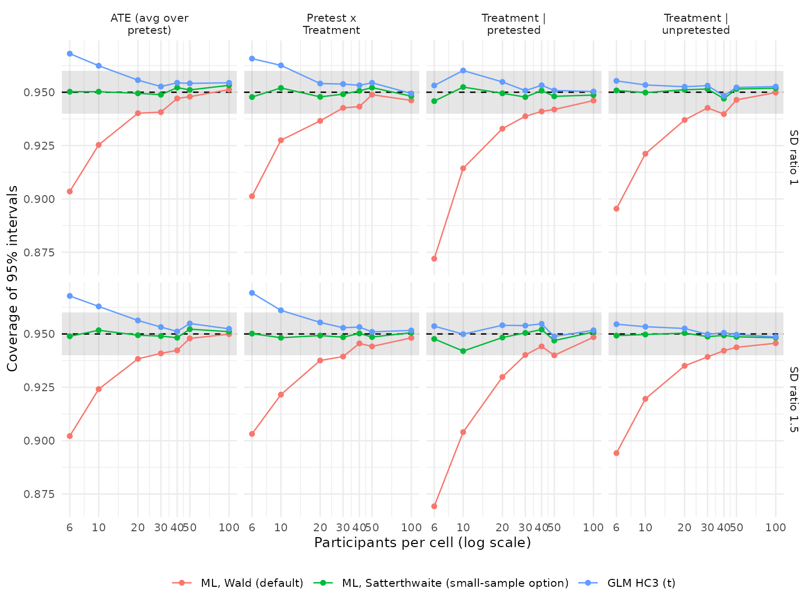

# Validating fit_solomon_ml(): A Simulation Study

This article reports the simulation validation of
[`fit_solomon_ml()`](https://juhalt.github.io/solomonR/reference/fit_solomon_ml.md).
The aims, data-generating mechanisms, estimands, methods, performance
measures, and tolerances were posted to [issue
\#10](https://github.com/JUhalt/solomonR/issues/10) before any results
were examined, following the ADEMP structure of Morris, White and
Crowther (2019).

The first run found that the default Wald intervals were too narrow in
small samples, which led to the small-sample option in [issue
\#22](https://github.com/JUhalt/solomonR/issues/22). Before the results
reported here were examined, the protocol was amended on that issue in
three ways:

- 30 and 40 participants per cell were added;
- the exploratory small-sample method was replaced by the implemented
  `inference = "satterthwaite"` option;
- a rule for the small-sample warning threshold was added.

This run supersedes the first; the first run’s results remain in the
package’s version history.

## Design

**Aims.** Check whether
[`fit_solomon_ml()`](https://juhalt.github.io/solomonR/reference/fit_solomon_ml.md)
recovers the four Solomon contrasts, whether its standard errors are
calibrated, and whether its 95% intervals reach nominal coverage. Both
inference options are evaluated:

- `inference = "wald"`, the default, which follows van Engelenburg
  (1999);
- `inference = "satterthwaite"`, which uses unbiased residual variances
  within each pretest condition and Welch-Satterthwaite degrees of
  freedom for contrasts that combine them (Satterthwaite, 1946; Welch,
  1947).

Both are compared with the unified GLM using HC3 standard errors and t
reference distributions. A further aim is to locate the cell size below
which
[`fit_solomon_ml()`](https://juhalt.github.io/solomonR/reference/fit_solomon_ml.md)
warns that Wald inference may be unreliable.

**Data-generating mechanisms.** A full factorial of 84 scenarios crosses
four factors:

- participants per cell: 6, 10, 20, 30, 40, 50, 100;
- sensitization: 0 or 0.3;
- pretest-posttest correlation: 0, 0.5, or 0.8;
- residual standard deviation of treated relative to control
  participants: 1 or 1.5.

Every participant has a latent baseline that only pretested participants
observe, so structural pretest absence is present in every scenario. The
treatment effect is 0.5 among unpretested participants and 0.5 plus the
sensitization among pretested participants.

**Performance measures.** Each of the following comes with its Monte
Carlo standard error (MCSE), from 2,000 replications per scenario:

- bias;
- empirical and model-based standard errors;
- coverage of 95% intervals;
- the rejection rate at alpha = .05;
- fit failures.

**Tolerances.**

- Bias within 2 MCSE of zero.
- Coverage between 0.940 and 0.960.
- Model standard errors within 5% of the empirical standard error.
- Type I error for the sensitization test between 0.040 and 0.060 when
  there is no sensitization.
- No fit failures.

**Warning threshold rule.** The threshold is the smallest cell size at
which Wald inference meets both of the following criteria within each
residual-SD ratio, at that size and at every larger size studied:

- mean coverage of at least 0.940;
- mean sensitization Type I error of at most 0.060.

These are the liberal edges of the tolerance bands. The warning concerns
intervals that are too narrow, so over-coverage does not count against
Wald inference.

## Fit failures

| Method                                  | Failed fits across all scenarios |
|:----------------------------------------|---------------------------------:|
| ML, Wald (default)                      |                                0 |
| ML, Satterthwaite (small-sample option) |                                0 |
| GLM HC3 (t)                             |                                0 |

## Coverage

    #> Warning in scale_x_log10(breaks = cell_sizes): log-10
    #> transformation introduced infinite values.

Coverage is averaged over the correlation and sensitization conditions;
the shaded band is the pre-declared tolerance. Scenario-level values and
their MCSEs are in `ml-validation/performance.csv`.

| Method | n = 6 | n = 10 | n = 20 | n = 30 | n = 40 | n = 50 | n = 100 |
|:---|:---|:---|:---|:---|:---|:---|:---|
| ML, Wald (default) | 0.893 | 0.920 | 0.936 | 0.941 | 0.943 | 0.945 | 0.948 |
| ML, Satterthwaite (small-sample option) | 0.949 | 0.950 | 0.949 | 0.949 | 0.950 | 0.950 | 0.950 |
| GLM HC3 (t) | 0.961 | 0.958 | 0.954 | 0.953 | 0.952 | 0.952 | 0.951 |

Mean coverage across scenarios and contrasts {.table
style="width:100%;"}

| Method | n = 6 | n = 10 | n = 20 | n = 30 | n = 40 | n = 50 | n = 100 |
|:---|:---|:---|:---|:---|:---|:---|:---|
| ML, Wald (default) | 0.860 | 0.891 | 0.922 | 0.933 | 0.932 | 0.930 | 0.936 |
| ML, Satterthwaite (small-sample option) | 0.931 | 0.933 | 0.941 | 0.944 | 0.936 | 0.935 | 0.940 |
| GLM HC3 (t) | 0.947 | 0.943 | 0.944 | 0.947 | 0.940 | 0.938 | 0.941 |

Lowest coverage across scenarios and contrasts {.table
style="width:100%;"}

## Bias

| Method | Largest absolute bias | Estimates beyond 2 MCSE |
|:---|:---|:---|
| ML, Wald (default) | 0.028 | 17 of 336 |
| ML, Satterthwaite (small-sample option) | 0.028 | 17 of 336 |
| GLM HC3 (t) | 0.028 | 17 of 336 |

The three methods produce identical point estimates, so their bias is
identical. With 2 MCSE as the tolerance, roughly 5% of
scenario-by-contrast estimates are expected to fall outside it by chance
even for an unbiased estimator.

## Standard error calibration

| Method | n = 6 | n = 10 | n = 20 | n = 30 | n = 40 | n = 50 | n = 100 |
|:---|:---|:---|:---|:---|:---|:---|:---|
| ML, Wald (default) | -10.8% | -6.5% | -3.0% | -2.3% | -1.6% | -1.2% | -0.4% |
| ML, Satterthwaite (small-sample option) | +0.1% | -0.2% | +0.1% | -0.2% | -0.1% | -0.0% | +0.2% |
| GLM HC3 (t) | +14.0% | +7.1% | +3.4% | +1.9% | +1.5% | +1.3% | +0.8% |

Mean relative error of model-based standard errors {.table
style="width:100%;"}

## Type I error for sensitization

| Method | n = 6 | n = 10 | n = 20 | n = 30 | n = 40 | n = 50 | n = 100 |
|:---|:---|:---|:---|:---|:---|:---|:---|
| ML, Wald (default) | 0.099 | 0.077 | 0.064 | 0.059 | 0.057 | 0.054 | 0.053 |
| ML, Satterthwaite (small-sample option) | 0.052 | 0.052 | 0.053 | 0.051 | 0.051 | 0.050 | 0.051 |
| GLM HC3 (t) | 0.034 | 0.038 | 0.047 | 0.046 | 0.048 | 0.048 | 0.050 |

Rejection rate of the Pretest x Treatment test with no sensitization
(nominal .05) {.table style="width:100%;"}

## Scenarios meeting every tolerance

| Method | n = 6 | n = 10 | n = 20 | n = 30 | n = 40 | n = 50 | n = 100 |
|:---|:---|:---|:---|:---|:---|:---|:---|
| ML, Wald (default) | 0 of 12 | 0 of 12 | 0 of 12 | 2 of 12 | 3 of 12 | 5 of 12 | 8 of 12 |
| ML, Satterthwaite (small-sample option) | 8 of 12 | 6 of 12 | 11 of 12 | 11 of 12 | 8 of 12 | 9 of 12 | 9 of 12 |
| GLM HC3 (t) | 0 of 12 | 0 of 12 | 5 of 12 | 10 of 12 | 7 of 12 | 7 of 12 | 8 of 12 |

Scenarios in which all four contrasts meet every tolerance {.table
style="width:100%;"}

## Warning threshold

| Participants per cell | SD ratio | Mean coverage | Type I error | Meets both criteria |
|---:|---:|:---|:---|:---|
| 6 | 1.0 | 0.893 | 0.102 | no |
| 6 | 1.5 | 0.892 | 0.095 | no |
| 10 | 1.0 | 0.922 | 0.075 | no |
| 10 | 1.5 | 0.917 | 0.079 | no |
| 20 | 1.0 | 0.937 | 0.061 | no |
| 20 | 1.5 | 0.935 | 0.067 | no |
| 30 | 1.0 | 0.941 | 0.056 | yes |
| 30 | 1.5 | 0.940 | 0.063 | no |
| 40 | 1.0 | 0.943 | 0.059 | yes |
| 40 | 1.5 | 0.944 | 0.055 | yes |
| 50 | 1.0 | 0.946 | 0.050 | yes |
| 50 | 1.5 | 0.944 | 0.058 | yes |
| 100 | 1.0 | 0.948 | 0.054 | yes |
| 100 | 1.5 | 0.948 | 0.053 | yes |

Wald inference from fit_solomon_ml() against the threshold criteria
{.table}

By this rule, the threshold is 40 participants per cell.
[`fit_solomon_ml()`](https://juhalt.github.io/solomonR/reference/fit_solomon_ml.md)
warns when the smallest cell has fewer participants and `inference` was
not supplied.

## Conclusions

**Estimand recovery is validated.** All three methods produce the same
point estimates. The largest absolute bias was 0.028 standard-deviation
units, at 6 participants per cell. 17 of 336 scenario-by-contrast
estimates (5.1%) fell outside 2 MCSE, close to the 15 expected by
chance. No fit failed.

**Default Wald inference from
[`fit_solomon_ml()`](https://juhalt.github.io/solomonR/reference/fit_solomon_ml.md)
is too liberal in small samples.**

- **Coverage.** Mean coverage of its 95% intervals was 0.893 with 6
  participants per cell, 0.920 with 10, 0.936 with 20, and 0.941 with
  30, rising to 0.948 at 100. The treatment effect among pretested
  participants was affected most, with mean coverage of 0.871 at 6 per
  cell.
- **Standard errors.** They were 10.8% too small at 6 per cell and 6.5%
  too small at 10.
- **Type I error.** The sensitization test rejected a true null 9.9% of
  the time at 6 per cell, 7.7% at 10, and 6.4% at 20.
- **Tolerances.** Wald inference met every tolerance in none of the
  scenarios with 20 or fewer participants per cell, in 2 of 12 at 30, 3
  of 12 at 40, 5 of 12 at 50, and 8 of 12 at 100.

**The warning threshold is 40 participants per cell.**

- **At 30 per cell,** Wald inference narrowly failed the rule with
  unequal residual variances: mean coverage was 0.9399 and Type I error
  0.063.
- **From 40 per cell onward,** it met both criteria in both variance
  conditions.
- **The threshold marks where Wald inference becomes approximately
  adequate, not exact.** At 40 and 50 per cell its mean coverage was
  still 0.943 and 0.945, and about a quarter of scenario-by-contrast
  coverage values fell below 0.940.

**The small-sample option was calibrated at every cell size.**

- **Calibration.** Mean coverage was between 0.949 and 0.950, and Type I
  error between 0.050 and 0.053. Model standard errors were within 0.2%
  of the empirical standard errors on average and within 5% in every
  scenario.
- **Misses match Monte Carlo error.** 14 of 336 coverage values fell
  outside 0.940 to 0.960, against 13.5 expected by chance. 3 of 42
  sensitization Type I error rates fell outside 0.040 to 0.060, the most
  extreme at 0.0625.
- **Lowest coverage.** 0.931, for the ATE with 6 participants per cell
  and unequal residual variances.

**The unified GLM with HC3 is conservative in small samples.**

- **Over-coverage.** Its intervals over-covered at 10 or fewer
  participants per cell, with mean coverage of 0.961 at 6 and 0.958 at
  10.
- **Standard errors.** They overestimated variability by 14.0% at 6 per
  cell and 7.1% at 10.
- **Type I error.** The sensitization test’s Type I error was 0.034 at 6
  per cell.
- **Near nominal from 20 per cell.** Mean coverage was 0.951 to 0.954,
  and its lowest coverage in any scenario was 0.938.

Unequal residual standard deviations between arms (ratio 1.5) changed
mean coverage by less than 0.01 for every method at every cell size.

**Practical guidance from this validation:**

- With fewer than 40 participants in the smallest cell, use
  `fit_solomon_ml(inference = "satterthwaite")` or
  [`fit_solomon_glm()`](https://juhalt.github.io/solomonR/reference/fit_solomon_glm.md)
  rather than the default Wald intervals.
- The small-sample option can be used at any cell size; with 100
  participants per cell its results and those of Wald inference are
  close.
- [`fit_solomon_glm()`](https://juhalt.github.io/solomonR/reference/fit_solomon_glm.md)
  with HC3 errs on the conservative side with 10 or fewer participants
  per cell.

**Not covered:** non-normal errors, clustered designs, missing posttest
scores, and incidental pretest missingness.

## Reproducing these results

The simulation script is
`vignettes/articles/ml-validation/ml-simulation.R` in the package
repository. It was run with R 4.6.1, base seed 20260914, and 2,000
replications per scenario.

The run used the development version of the package that implemented the
small-sample option, based on commit `4e1d820`; `run-information.csv`
records this. In that version, the estimation and inference code of
[`fit_solomon_ml()`](https://juhalt.github.io/solomonR/reference/fit_solomon_ml.md)
and
[`fit_solomon_glm()`](https://juhalt.github.io/solomonR/reference/fit_solomon_glm.md)
is identical to the code committed with this article. Later changes
affected only documentation and the warning threshold, and the
simulation suppresses warnings.

## References

Morris, T. P., White, I. R., & Crowther, M. J. (2019). Using simulation
studies to evaluate statistical methods. *Statistics in Medicine, 38*,
2074-2102.

Satterthwaite, F. E. (1946). An approximate distribution of estimates of
variance components. *Biometrics Bulletin, 2*, 110-114.

van Engelenburg, G. (1999). *Statistical analysis for the Solomon
four-group design* (Research Report 99-06). University of Twente.

Welch, B. L. (1947). The generalization of “Student’s” problem when
several different population variances are involved. *Biometrika, 34*,
28-35.
