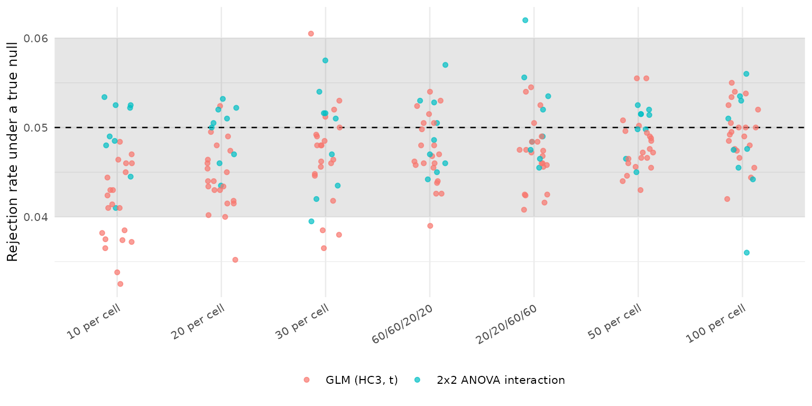
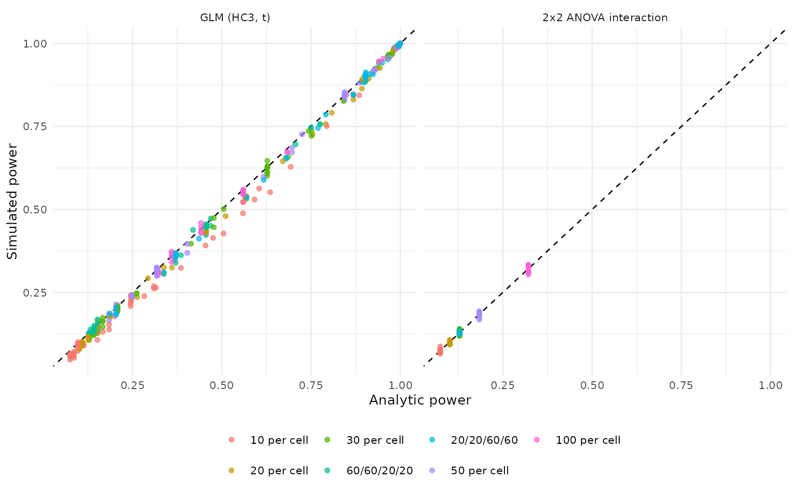

# Validating power_solomon(): A Simulation Study

This article reports the simulation validation of
[`power_solomon()`](https://juhalt.github.io/solomonR/reference/power_solomon.md)
requested in [issue \#18](https://github.com/JUhalt/solomonR/issues/18).
The aims, data-generating mechanisms, estimands, methods, performance
measures, and tolerances were posted to that issue before any results
were examined, following the ADEMP structure of Morris, White and
Crowther (2019). An amendment reducing the grid to a practical runtime
was also posted before the run, and changed no tolerance.

The study drives
[`power_solomon()`](https://juhalt.github.io/solomonR/reference/power_solomon.md)
itself rather than a parallel implementation, so what is validated is
the function users call.

## Design

**Aims.** Establish that each reported test holds its nominal Type I
error when the corresponding effect is zero, that simulated power agrees
with analytic power where an analytic result exists, and that every
reported number carries its Monte Carlo uncertainty.

**Data-generating mechanisms.** Every participant has a latent baseline
drawn from a standard normal distribution, which only pretested
participants observe, so structural pretest absence is present in every
scenario. The posttest residual standard deviation is 1 in every cell,
the pretest-posttest correlation among pretested participants is `rho`,
the treatment effect is `delta` among unpretested participants, and
sensitization adds `sens` among pretested participants.

The grid crosses:

- **allocation:** 10, 20, 30, 50, and 100 participants per cell, plus
  the unequal allocations 60/60/20/20 and 20/20/60/60;
- **`delta`:** 0, 0.3, 0.6;
- **`sens`:** 0, 0.3;
- **`rho`:** 0, 0.5, 0.8.

**Methods.** The three procedures
[`power_solomon()`](https://juhalt.github.io/solomonR/reference/power_solomon.md)
reports: the unified GLM with HC3 standard errors and t reference
distributions, the 2x2 ANOVA interaction, and the historical one-tailed
Test I (Braver & Braver, 1988).

**Analytic benchmarks.** Normal-theory rejection probabilities computed
from the design: a two-sample t test for the unpretested contrast, an
ANCOVA comparison with residual variance reduced by the squared
pretest-posttest correlation for the pretested contrast, and
Welch-Satterthwaite degrees of freedom for the contrasts that combine
pretest conditions. The 2x2 ANOVA interaction is benchmarked with pooled
variance and no pretest adjustment. Test I combines two p-values
directionally and has no closed form, so it is reported without a
benchmark.

**Performance measures.** The rejection rate of each test with its Monte
Carlo standard error, the difference from the analytic benchmark, and
the number of fit failures. Replications: 5,000 in complete-null
scenarios and 2,000 elsewhere.

**Tolerances.** Type I error between 0.040 and 0.060 wherever the true
effect is zero; power within 0.02 of the analytic benchmark or within 2
Monte Carlo standard errors, whichever is larger; no fit failures; and
scale invariance at a residual standard deviation of 2 with
proportionally scaled effects.

## Fit failures

| Test                           | Failed fits across all scenarios |
|:-------------------------------|---------------------------------:|
| GLM (HC3, t)                   |                                0 |
| 2x2 ANOVA interaction          |                                0 |
| Test I (Braver & Braver, 1988) |                                0 |

## Type I error

| Test | 10 per cell | 20 per cell | 30 per cell | 60/60/20/20 | 20/20/60/60 | 50 per cell | 100 per cell |
|:---|:---|:---|:---|:---|:---|:---|:---|
| GLM (HC3, t) | 0.041 | 0.044 | 0.047 | 0.047 | 0.047 | 0.048 | 0.049 |
| 2x2 ANOVA interaction | 0.049 | 0.049 | 0.049 | 0.049 | 0.051 | 0.050 | 0.048 |

Mean rejection rate where the true effect is zero (nominal .05) {.table}

The shaded band is the pre-declared tolerance. Each point is one
scenario.

## Agreement with analytic power

| Test | 10 per cell | 20 per cell | 30 per cell | 60/60/20/20 | 20/20/60/60 | 50 per cell | 100 per cell |
|:---|:---|:---|:---|:---|:---|:---|:---|
| GLM (HC3, t) | -0.030 | -0.017 | -0.009 | -0.006 | -0.011 | -0.005 | -0.003 |
| 2x2 ANOVA interaction | -0.000 | -0.002 | -0.001 | +0.001 | -0.000 | -0.000 | -0.000 |

Mean difference between simulated and analytic power {.table}

| Test | 10 per cell | 20 per cell | 30 per cell | 60/60/20/20 | 20/20/60/60 | 50 per cell | 100 per cell |
|:---|:---|:---|:---|:---|:---|:---|:---|
| GLM (HC3, t) | 41% | 63% | 88% | 94% | 75% | 96% | 98% |
| 2x2 ANOVA interaction | 100% | 100% | 100% | 100% | 100% | 100% | 100% |

Share of scenarios within the pre-declared tolerance {.table}

## Historical Test I

| Allocation   | Rejection rate under the complete null |
|:-------------|---------------------------------------:|
| 10 per cell  |                                  0.051 |
| 20 per cell  |                                  0.047 |
| 30 per cell  |                                  0.051 |
| 60/60/20/20  |                                  0.049 |
| 20/20/60/60  |                                  0.052 |
| 50 per cell  |                                  0.050 |
| 100 per cell |                                  0.051 |

Test I combines two one-tailed p-values, so it is reported as a
historical procedure rather than a recommended one, and its rejection
rate is not compared with a two-sided benchmark.

## Scale invariance

| Estimand | Test | SD 1 | SD 2 | Difference |
|:---|:---|:---|:---|:---|
| ATE (avg over pretest) | GLM (HC3, t) | 0.964 | 0.964 | +0.000 |
| Pretest x Treatment | GLM (HC3, t) | 0.136 | 0.136 | +0.000 |
| Treatment \| pretested | GLM (HC3, t) | 0.938 | 0.938 | +0.000 |
| Treatment \| unpretested | GLM (HC3, t) | 0.455 | 0.455 | +0.000 |
| Pretest x Treatment | 2x2 ANOVA interaction | 0.134 | 0.134 | +0.000 |
| Treatment (one-sided) | Test I (Braver & Braver, 1988) | 0.986 | 0.986 | +0.000 |

Rejection rates with proportionally scaled effects and residual SD
{.table}

## Conclusions

**The simulator is validated.** Across 126 scenarios and 315,000
replications, no fit failed, and three independent checks agreed:

- **Analytic agreement.** The 2x2 ANOVA interaction matched its
  normal-theory benchmark in every scenario at every allocation, with
  mean differences of 0.002 or less.
- **Nominal size for Test I.** Under the complete null, the historical
  one-tailed combination rejected between 4.4% and 5.6% of the time at
  alpha = .05.
- **Scale invariance.** Doubling the residual standard deviation with
  proportionally scaled effects reproduced every rejection rate exactly.

**Rejection rates from the unified GLM are conservative in small
samples.** Type I error averaged 0.041 with 10 participants per cell,
rising through 0.044 at 20 and 0.047 at 30 to 0.049 at 100. Simulated
power fell below the normal-theory benchmark by 0.030 on average with 10
per cell, 0.017 with 20, 0.009 with 30, 0.005 with 50, and 0.003 with
100; the largest single difference was 0.083, for the ATE with 10 per
cell. Agreement within the pre-declared tolerance rose from 41% of
scenarios at 10 per cell to 98% at 100.

**This traces to HC3, not to the simulator.** The ANOVA arm is computed
on the same simulated data sets and matched its benchmark exactly, so
the deviation belongs to the covariance estimator rather than the
data-generating mechanism. It is the same conservatism the
[`fit_solomon_ml()`](https://juhalt.github.io/solomonR/reference/fit_solomon_ml.md)
validation found, where HC3 intervals over-covered at small cell sizes
(mean coverage 0.961 with 6 participants per cell). The protocol
registered this deviation in advance.

**Unequal allocation behaved like equal allocation of similar size.**
The 60/60/20/20 and 20/20/60/60 designs agreed with their benchmarks in
94% and 74% of scenarios, between the 20- and 50-per-cell equal
allocations.

**Of 210 null scenarios, 17 fell outside the 0.040 to 0.060 band**, 15
of them below it. The low side is the HC3 conservatism described above;
the two above the band, at 0.0605 and 0.0620, are within about two Monte
Carlo standard errors of 0.05 and are consistent with simulation noise.

**Practical guidance from this validation:**

- Power reported for the GLM tests with 20 or fewer participants per
  cell is a conservative figure; the normal-theory benchmark in this
  article is the optimistic end of the range.
- The 2x2 ANOVA interaction is the arm to compare against analytic
  expectations, but it ignores the pretest, so it is less powerful than
  the GLM whenever the pretest is informative.
- Test I remains a historical procedure. Its size is nominal under the
  complete null, which does not make the conditional sequence it belongs
  to safe; see the method guide.

**Not covered:** non-normal errors, clustered designs, binary and count
outcomes, missing posttest scores, and incidental pretest missingness.

## Reproducing these results

The simulation script is
`vignettes/articles/power-validation/power-simulation.R` in the package
repository. It was run at 2a944c8 plus \#18 rebuild (solomon_power.R md5
180d6330d91d) with R 4.6.1, base seed 20260916, and the replication
counts above.

## References

Braver, M. W., & Braver, S. L. (1988). Statistical treatment of the
Solomon four-group design: A meta-analytic approach. *Psychological
Bulletin, 104*, 150-154.

Morris, T. P., White, I. R., & Crowther, M. J. (2019). Using simulation
studies to evaluate statistical methods. *Statistics in Medicine, 38*,
2074-2102.

Solomon, R. L. (1949). An extension of control group design.
*Psychological Bulletin, 46*, 137-150.
